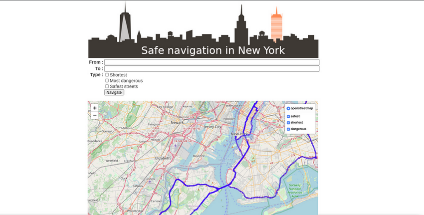

# Find a path through New York City
Based on a dataset containing the data of car accidents in New York City, we had to create a website allowing the user to search for the safest route between 2 locations.

### Team Members
- [Axelle Paquet]
- [Imad Haj Rashid]
- [Jérôme Coumont]
- [Ousmane Diop]
- [Reza Nasrollahrikaran]

## Summary
### Mission objectives
- Learn and apply graph traversal algorithms
- Apply basic statistics on a dataset
- Work with geolocalized data

## Usage
Launch the API : `python route.py`  
Access the API by using this url : http://localhost:5000/  

## Installation
The needed libraries are in the requirement.txt. To install it, use the command below:  
  
``` Bash
python -m pip install -r requirements.txt
```  
### *Links to documentation :*
- [Flask](https://flask.palletsprojects.com/en/1.1.x/) : To display the website
- [Docker](https://docs.docker.com/) : to run the code int a container and deploy it on Azure
- [Networkx](https://networkx.org/documentation/stable/) : To create and manipulate a graph
- [Osmnx](https://osmnx.readthedocs.io/en/stable/osmnx.html) : to manipulate coordinates
- [Folium](https://python-visualization.github.io/folium/) : to diplay a map of New York
## Live version
The live version is [here](https://nyc-navigation.azurewebsites.net/)
